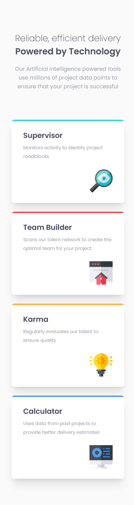
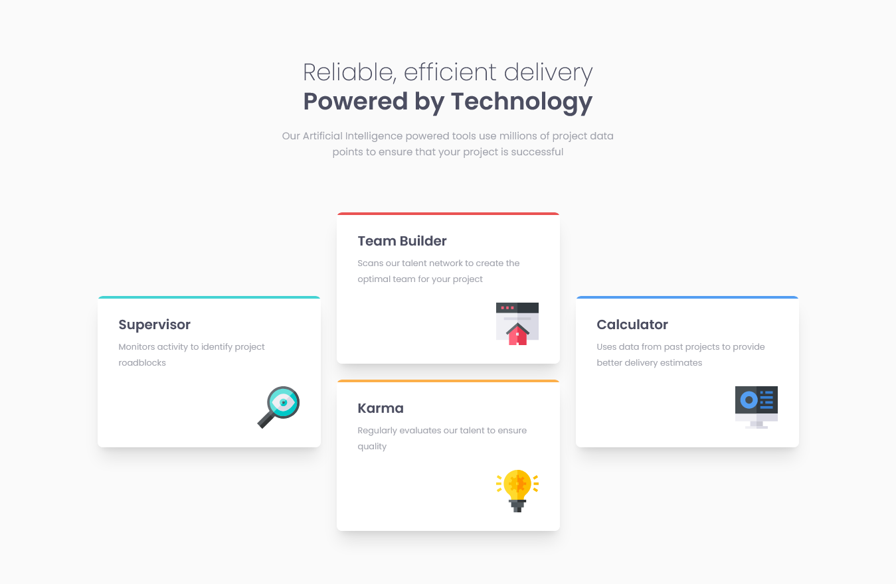

# Frontend Mentor - Four card feature section solution

This is a solution to the [Four card feature section challenge on Frontend Mentor](https://www.frontendmentor.io/challenges/four-card-feature-section-weK1eFYK). Frontend Mentor challenges help you improve your coding skills by building realistic projects.

## Table of contents

- [Overview](#overview)
  - [The challenge](#the-challenge)
  - [Screenshot](#screenshot)
    - [Mobile](#mobile)
    - [Desktop](#desktop)
  - [Links](#links)
- [My process](#my-process)
  - [Built with](#built-with)
  - [What I learned](#what-i-learned)
  - [Continued development](#continued-development)
  - [Useful resources](#useful-resources)
- [Author](#author)

## Overview

### The challenge

Users should be able to:

- View the optimal layout for the site depending on their device's screen size

### Screenshot

#### Mobile



#### Desktop



### Links

- Solution URL: [source code](https://github.com/SilvanosEric/fem-four-card-feature-section)
- Live Site URL: [website](https://silvanoseric.github.io/fem-four-card-feature-section/)

## My process

### Built with

- Semantic HTML5 markup
- [TailwindCSS](https://tailwindcss.com/)
- Flexbox
- Mobile-first workflow
- [CUBE CSS](https://cube.fyi/)
- [BEM](http://getbem.com/)
- [Vite](https://vitejs.dev/)

### What I learned

- Equal columns with flexbox. The code snippets below will create a flex container with flex items of equal width:

```html
<div class="container">
  <div class="item item1">I am content</div>
  <div class="item item2">I am another content</div>
  <div class="item item3">I am some other content</div>
</div>
```

```css
.container {
  display: flex;
  border: solid;
}

.item {
  flex-basis: 100%;
}

.item1 {
  border: solid red;
}

.item2 {
  border: solid green;
}

.item3 {
  border: solid blue;
}
```

- The flex items will remain of equal width. The length of their content will not play any role in setting their width.

### Continued development

- CUBE CSS ([Grouping](https://cube.fyi/grouping.html#grouping))

### Useful resources

- [Vite preview not working as expected](https://stackoverflow.com/questions/71925749/why-am-i-getting-cannot-get-in-localhost-for-vue-npm-run-serve) - The context of the problem (Vue) may have been different from my context (Vanilla JavasScript) but the solution proved to be effective. Vite preview is designed to serve the production version of the website. To view the production version one must first build it, using a build script as configured for a particular environment. Trying to run the preview command in my context without first running the build command caused the problem
- Before running the preview command first make sure the production version of the website is available in the "out dir". The out dir will have different names as per your environment. For me (Vite vanilla) the out dir is the dist folder

- A more precise solution is offered in the following github [discussion](https://github.com/vitejs/vite/discussions/4572)
  <br><br>

- [Equal Columns with Flexbox](https://css-tricks.com/equal-columns-with-flexbox-its-more-complicated-than-you-might-think/) - This is an amazing article which helped me finally understand, how to make flex items take up equal space in a flex container. I'd recommend it to anyone still learning this concept, as the author goes into details on how the flex items share space in a container with limited space, and also in a situation where there is plenty of space.

## Author

- Frontend Mentor - [@SilvanosEric](https://www.frontendmentor.io/profile/SilvanosEric)